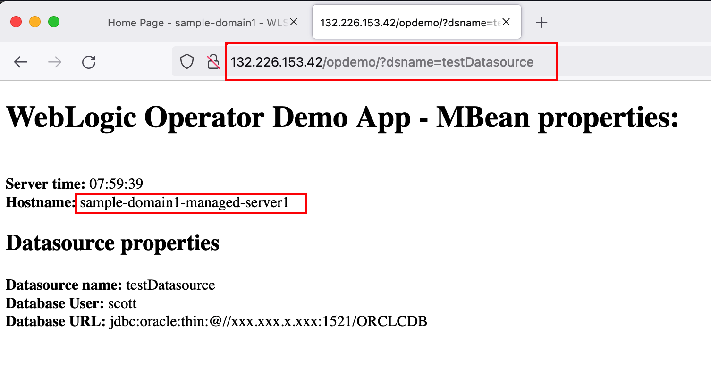

# Deploy a WebLogic domain

## Introduction

This lab walks you through the steps to deploy and configure WebLogic Kubernetes Operator on Kubernetes environment.

Estimated Lab Time: 25 minutes

## **STEP 1**: Prepare the Kubernetes cluster to run WebLogic domains

Create the domain namespace:
```bash
<copy>kubectl create namespace sample-domain1-ns</copy>
```
Create a Kubernetes secret containing the Administration Server boot credentials:

```bash
<copy>export WLS_USERNAME=weblogic
export WLS_PASSWORD=$((< /dev/urandom tr -dc 'A-Za-z0-9!"#$%&'\''*+,-./:;<=>?@\^_`|~' | head -c10);(date +%S))
echo $WLS_PASSWORD
kubectl create secret generic sample-domain1-weblogic-credentials --from-literal=password=$WLS_PASSWORD --from-literal=username=$WLS_USERNAME -n sample-domain1-ns</copy>
```

Note down the Admin Server Password, You need to use it for login to Admin Console.

## **STEP 2**: Update the Traefik load balancer and operator configuration

After you have your domain namespace (the WebLogic domain is not deployed yet), you have to update the load balancer and operator configuration to specify where the domain will be deployed.

To update the operator, execute the following `helm upgrade` command:
```bash
<copy>helm upgrade sample-weblogic-operator \
  weblogic-operator/weblogic-operator \
  --version 3.0.0 \
  --namespace sample-weblogic-operator-ns \
  --reuse-values \
  --set "domainNamespaces={sample-domain1-ns}" \
  --wait</copy>
```

To update Traefik, execute the following `helm upgrade` command:
```bash
<copy>helm upgrade traefik-operator \
  traefik/traefik \
  --namespace traefik \
  --reuse-values \
  --set "kubernetes.namespaces={traefik,sample-domain1-ns}" \
  --wait</copy>
```
Note that in both cases, the only updated parameter is the domain namespace.

## **STEP 3**: Deploy a WebLogic domain on Kubernetes

To deploy WebLogic domain, you need to create a domain resource definition which contains the necessary parameters for the operator to start the WebLogic domain properly.

We provided for you a `domain.yaml` file that contains a YAML representation of the custom resource object. Please copy it locally:
```bash
<copy>curl -LSs https://raw.githubusercontent.com/oracle/learning-library/master/solutions-library/weblogic-kubernetes/domain.v8.yaml  >~/domain.yaml</copy>
```
Review it in your favorite editor or a [browser](https://github.com/pandey-ankit/weblogic-kubernetes/blob/main/domain.v8.yaml).

Create the domain custom resource object with the following command:
```bash
<copy>kubectl apply -f ~/domain.yaml</copy>
```
Check the introspector job, which needs to be run first:
```bash
<copy>kubectl get pod -n sample-domain1-ns</copy>
```
The output should be similar to the following:
```bash
NAME                                         READY   STATUS              RESTARTS   AGE
sample-domain1-introspect-domain-job-k8rgf   0/1     ContainerCreating   0          12s
```
Periodically check the pods in the domain namespace and soon you will see the servers starting:
```bash
<copy>kubectl get po -n sample-domain1-ns -o wide</copy>
```
The output should be similar to the following:
```bash
NAME                             READY   STATUS    RESTARTS   AGE     IP             NODE         NOMINATED NODE   READINESS GATES
sample-domain1-admin-server      1/1     Running   0          3m50s   10.244.0.133   10.0.10.28   <none>           <none>
sample-domain1-managed-server1   1/1     Running   0          3m2s    10.244.0.135   10.0.10.28   <none>           <none>
sample-domain1-managed-server2   1/1     Running   0          3m2s    10.244.0.134   10.0.10.28   <none>           <none> 
```
You should see three running pods similar to the results shown above. If you don't see all the running pods, wait and then check periodically. The entire domain deployment may take up to 2-3 minutes depending on the compute shapes.

In order to access any application or the Administration Console deployed on WebLogic, you have to configure a *Traefik* Ingress. An OCI load balancer is already assigned during the *Traefik* install in the previous step.

As a simple solution, it's best to configure path routing, which will route external traffic through *Traefik* to the domain cluster address or the Administration Server Console.

Execute the following Ingress resource definition:
```bash
<copy>cat << EOF | kubectl apply -f -
apiVersion: extensions/v1beta1
kind: Ingress
metadata:
  name: traefik-pathrouting-1
  namespace: sample-domain1-ns
  annotations:
    kubernetes.io/ingress.class: traefik
spec:
  rules:
  - host:
    http:
      paths:
      - path: /
        backend:
          serviceName: sample-domain1-cluster-cluster-1
          servicePort: 8001
      - path: /console
        backend:
          serviceName: sample-domain1-admin-server
          servicePort: 7001          
EOF
</copy>
```

> You can ignore the warning.

Please note the two backends and the namespace, `serviceName`, `servicePort` definitions. The first backend is the domain cluster service to reach the application at the root context path. The second is for the admin console which is a different service.

Once the Ingress has been created construct the URL of the Administration Console based on the following pattern:

`http://EXTERNAL-IP/console`

The `EXTERNAL-IP` was determined during the Traefik install. If you forgot to note it, then execute the following command to get the public IP address:
```bash
<copy>kubectl describe svc traefik-operator --namespace traefik | grep Ingress | awk '{print $3}'</copy>
```
The output should be similar to the following:
```bash
132.226.153.42
```
Construct the Administration Console URL and open it in a browser:

Take the WebLogic Admin Server credential from step 1 of this lab 4 and enter the credentials  and click **Login**.


!Please note in this use case that the use of the Administration Console is just for demo/test purposes because the domain configuration is persisted in the pod, which means that after the restart, the original values (baked into the image) will be used again. To override certain configuration parameters - to ensure image portability - follow the override part of this tutorial.

## **STEP 4**: Test the sample web application

The URL pattern of the sample application is the following:

`http://EXTERNAL-IP/opdemo/?dsname=testDatasource`



Refresh the page and notice the hostname changes. It reflects the Managed Server's name which responds to the request. You should see load balancing between the two Managed Servers.

You may now **proceed to the next lab**.

## Acknowledgements
* **Author** - Maciej Gruszka, Peter Nagy
* **Last Updated By/Date** - December 2021
